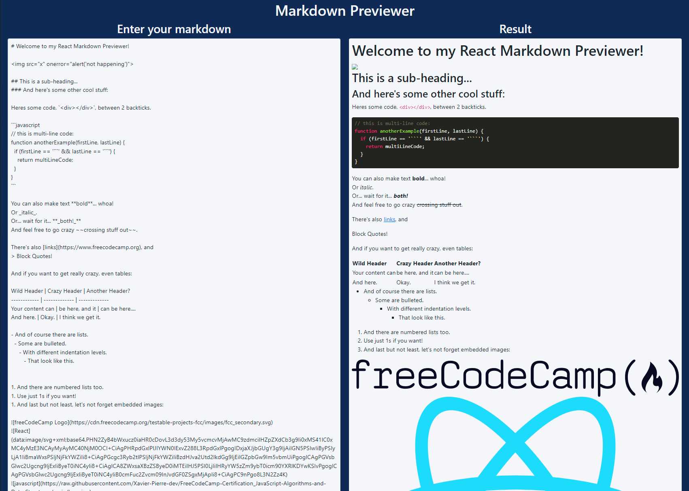
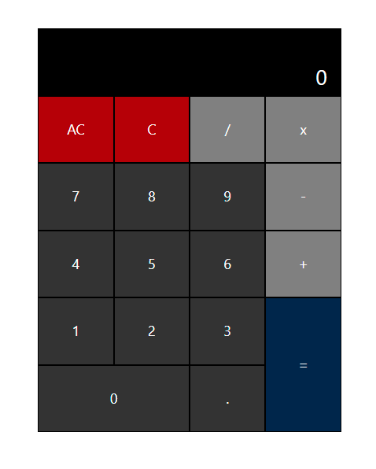
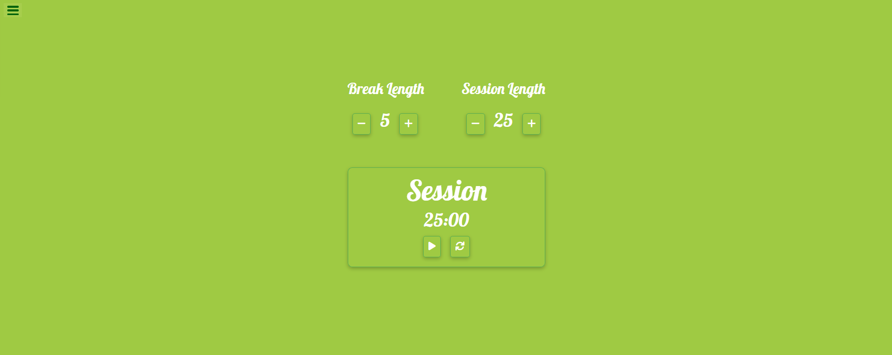

# 🚀 Freecodecamp certification : Front End Development Libraries 🚀
online course : https://www.freecodecamp.org/learn/front-end-development-libraries/


## Stacks :
<div align="center">


</div>


* [React](https://fr.reactjs.org/)
* [Redux](https://redux.js.org/)
* [Bootsrap](https://getbootstrap.com/)
* [jQuery](https://jquery.com/)
* [Sass](https://sass-lang.com/)
* ...


## __Summary :__


<details>
<summary><CODE>Bootstrap</CODE></summary>

* [Use Responsive Design with Bootstrap Fluid Containers](./1_Bootstrap/1_Use-Responsive-Design-with-Bootstrap-Fluid-Containers) > [code](./1_Bootstrap/1_Use-Responsive-Design-with-Bootstrap-Fluid-Containers/freecodecamps.html)  |  [readme](./1_Bootstrap/1_Use-Responsive-Design-with-Bootstrap-Fluid-Containers/README.md)
* [Make Images Mobile Responsive](./1_Bootstrap/2_Make-Images-Mobile-Responsive) > [code](./1_Bootstrap/2_Make-Images-Mobile-Responsive/freecodecamps.html)  |  [readme](./1_Bootstrap/2_Make-Images-Mobile-Responsive/README.md)
* [Center Text with Bootstrap](./1_Bootstrap/3_Center-Text-with-Bootstrap) > [code](./1_Bootstrap/3_Center-Text-with-Bootstrap/freecodecamps.html)  |  [readme](./1_Bootstrap/3_Center-Text-with-Bootstrap/README.md)
* [Create a Bootstrap Button](./1_Bootstrap/4_Create-a-Bootstrap-Button) > [code](./1_Bootstrap/4_Create-a-Bootstrap-Button/freecodecamps.html)  |  [readme](./1_Bootstrap/4_Create-a-Bootstrap-Button/README.md)
* [Create a Block Element Bootstrap Button](./1_Bootstrap/5_Create-a-Block-Element-Bootstrap-Button) > [code](./1_Bootstrap/5_Create-a-Block-Element-Bootstrap-Button/freecodecamps.html)  |  [readme](./1_Bootstrap/5_Create-a-Block-Element-Bootstrap-Button/README.md)
* [Taste the Bootstrap Button Color Rainbow](./1_Bootstrap/6_Taste-the-Bootstrap-Button-Color-Rainbow) > [code](./1_Bootstrap/6_Taste-the-Bootstrap-Button-Color-Rainbow/freecodecamps.html)  |  [readme](./1_Bootstrap/6_Taste-the-Bootstrap-Button-Color-Rainbow/README.md)
* [Call out Optional Actions with btn info](./1_Bootstrap/7_Call-out-Optional-Actions-with-btn-info) > [code](./1_Bootstrap/7_Call-out-Optional-Actions-with-btn-info/freecodecamps.html)  |  [readme](./1_Bootstrap/7_Call-out-Optional-Actions-with-btn-info/README.md)
* [Warn Your Users of a Dangerous Action with btn danger](./1_Bootstrap/8_Warn-Your-Users-of-a-Dangerous-Action-with-btn-danger) > [code](./1_Bootstrap/8_Warn-Your-Users-of-a-Dangerous-Action-with-btn-danger/freecodecamps.html)  |  [readme](./1_Bootstrap/8_Warn-Your-Users-of-a-Dangerous-Action-with-btn-danger/README.md)
* [Use the Bootstrap Grid to Put Elements Side By Side](./1_Bootstrap/9_Use-the-Bootstrap-Grid-to-Put-Elements-Side-By-Side) > [code](./1_Bootstrap/9_Use-the-Bootstrap-Grid-to-Put-Elements-Side-By-Side/freecodecamps.html)  |  [readme](./1_Bootstrap/9_Use-the-Bootstrap-Grid-to-Put-Elements-Side-By-Side/README.md)
* [Ditch Custom CSS for Bootstrap](./1_Bootstrap/10_Ditch-Custom-CSS-for-Bootstrap) > [code](./1_Bootstrap/10_Ditch-Custom-CSS-for-Bootstrap/freecodecamps.html)  |  [readme](./1_Bootstrap/10_Ditch-Custom-CSS-for-Bootstrap/README.md)
* [Use a span to Target Inline Elements](./1_Bootstrap/11_Use-a-span-to-Target-Inline-Elements) > [code](./1_Bootstrap/11_Use-a-span-to-Target-Inline-Elements/freecodecamps.html)  |  [readme](./1_Bootstrap/11_Use-a-span-to-Target-Inline-Elements/README.md)
* [Create a Custom Heading](./1_Bootstrap/12_Create-a-Custom-Heading) > [code](./1_Bootstrap/12_Create-a-Custom-Heading/freecodecamps.html)  |  [readme](./1_Bootstrap/12_Create-a-Custom-Heading/README.md)
* [Add Font Awesome Icons to our Buttons](./1_Bootstrap/13_Add-Font-Awesome-Icons-to-our-Buttons) > [code](./1_Bootstrap/13_Add-Font-Awesome-Icons-to-our-Buttons/freecodecamps.html)  |  [readme](./1_Bootstrap/13_Add-Font-Awesome-Icons-to-our-Buttons/README.md)
* [Add Font Awesome Icons to all of our Buttons](./1_Bootstrap/14_Add-Font-Awesome-Icons-to-all-of-our-Buttons) > [code](./1_Bootstrap/14_Add-Font-Awesome-Icons-to-all-of-our-Buttons/freecodecamps.html)  |  [readme](./1_Bootstrap/14_Add-Font-Awesome-Icons-to-all-of-our-Buttons/README.md)
* [Responsively Style Radio Buttons](./1_Bootstrap/15_Responsively-Style-Radio-Buttons) > [code](./1_Bootstrap/15_Responsively-Style-Radio-Buttons/freecodecamps.html)  |  [readme](./1_Bootstrap/15_Responsively-Style-Radio-Buttons/README.md)
* [Responsively Style Checkboxes](./1_Bootstrap/16_Responsively-Style-Checkboxes) > [code](./1_Bootstrap/16_Responsively-Style-Checkboxes/freecodecamps.html)  |  [readme](./1_Bootstrap/16_Responsively-Style-Checkboxes/README.md)
* [Style Text Inputs as Form Controls](./1_Bootstrap/17_Style-Text-Inputs-as-Form-Controls) > [code](./1_Bootstrap/17_Style-Text-Inputs-as-Form-Controls/freecodecamps.html)  |  [readme](./1_Bootstrap/17_Style-Text-Inputs-as-Form-Controls/README.md)
* [Line up Form Elements Responsively with Bootstrap](./1_Bootstrap/18_Line-up-Form-Elements-Responsively-with-Bootstrap) > [code](./1_Bootstrap/18_Line-up-Form-Elements-Responsively-with-Bootstrap/freecodecamps.html)  |  [readme](./1_Bootstrap/18_Line-up-Form-Elements-Responsively-with-Bootstrap/README.md)
* [Create a Bootstrap Headline](./1_Bootstrap/19_Create-a-Bootstrap-Headline) > [code](./1_Bootstrap/19_Create-a-Bootstrap-Headline/freecodecamps.html)  |  [readme](./1_Bootstrap/19_Create-a-Bootstrap-Headline/README.md)
* [House our page within a Bootstrap container fluid div](./1_Bootstrap/20_House-our-page-within-a-Bootstrap-container-fluid-div) > [code](./1_Bootstrap/20_House-our-page-within-a-Bootstrap-container-fluid-div/freecodecamps.html)  |  [readme](./1_Bootstrap/20_House-our-page-within-a-Bootstrap-container-fluid-div/README.md)
* [Create a Bootstrap Row](./1_Bootstrap/21_Create-a-Bootstrap-Row) > [code](./1_Bootstrap/21_Create-a-Bootstrap-Row/freecodecamps.html)  |  [readme](./1_Bootstrap/21_Create-a-Bootstrap-Row/README.md)
* [Split Your Bootstrap Row](./1_Bootstrap/22_Split-Your-Bootstrap-Row) > [code](./1_Bootstrap/22_Split-Your-Bootstrap-Row/freecodecamps.html)  |  [readme](./1_Bootstrap/22_Split-Your-Bootstrap-Row/README.md)
* [Create Bootstrap Wells](./1_Bootstrap/23_Create-Bootstrap-Wells) > [code](./1_Bootstrap/23_Create-Bootstrap-Wells/freecodecamps.html)  |  [readme](./1_Bootstrap/23_Create-Bootstrap-Wells/README.md)
* [Add Elements within Your Bootstrap Wells](./1_Bootstrap/24_Add-Elements-within-Your-Bootstrap-Wells) > [code](./1_Bootstrap/24_Add-Elements-within-Your-Bootstrap-Wells/freecodecamps.html)  |  [readme](./1_Bootstrap/24_Add-Elements-within-Your-Bootstrap-Wells/README.md)
* [Apply the Default Bootstrap Button Style](./1_Bootstrap/25_Apply-the-Default-Bootstrap-Button-Style) > [code](./1_Bootstrap/25_Apply-the-Default-Bootstrap-Button-Style/freecodecamps.html)  |  [readme](./1_Bootstrap/25_Apply-the-Default-Bootstrap-Button-Style/README.md)
* [Create a Class to Target with jQuery Selectors](./1_Bootstrap/26_Create-a-Class-to-Target-with-jQuery-Selectors) > [code](./1_Bootstrap/26_Create-a-Class-to-Target-with-jQuery-Selectors/freecodecamps.html)  |  [readme](./1_Bootstrap/26_Create-a-Class-to-Target-with-jQuery-Selectors/README.md)
* [Add id Attributes to Bootstrap Elements](./1_Bootstrap/27_Add-id-Attributes-to-Bootstrap-Elements) > [code](./1_Bootstrap/27_Add-id-Attributes-to-Bootstrap-Elements/freecodecamps.html)  |  [readme](./1_Bootstrap/27_Add-id-Attributes-to-Bootstrap-Elements/README.md)
* [Label Bootstrap Wells](./1_Bootstrap/28_Label-Bootstrap-Wells) > [code](./1_Bootstrap/28_Label-Bootstrap-Wells/freecodecamps.html)  |  [readme](./1_Bootstrap/28_Label-Bootstrap-Wells/README.md)
* [Give Each Element a Unique id](./1_Bootstrap/29_Give-Each-Element-a-Unique-id) > [code](./1_Bootstrap/29_Give-Each-Element-a-Unique-id/freecodecamps.html)  |  [readme](./1_Bootstrap/29_Give-Each-Element-a-Unique-id/README.md)
* [Label Bootstrap Buttons](./1_Bootstrap/30_Label-Bootstrap-Buttons) > [code](./1_Bootstrap/30_Label-Bootstrap-Buttons/freecodecamps.html)  |  [readme](./1_Bootstrap/30_Label-Bootstrap-Buttons/README.md)
* [Use Comments to Clarify Code](./1_Bootstrap/31_Use-Comments-to-Clarify-Code) > [code](./1_Bootstrap/31_Use-Comments-to-Clarify-Code/freecodecamps.html)  |  [readme](./1_Bootstrap/31_Use-Comments-to-Clarify-Code/README.md)

</details>

<details>
<summary><CODE>jQuery</CODE></summary>

* [Learn How Script Tags and Document Ready Work](./2_jQuery/1_Learn-How-Script-Tags-and-Document-Ready-Work) > [code](./2_jQuery/1_Learn-How-Script-Tags-and-Document-Ready-Work/freecodecamps.html)  |  [readme](./2_jQuery/1_Learn-How-Script-Tags-and-Document-Ready-Work/README.md)
* [Target HTML Elements with Selectors Using jQuery](./2_jQuery/2_Target-HTML-Elements-with-Selectors-Using-jQuery) > [code](./2_jQuery/2_Target-HTML-Elements-with-Selectors-Using-jQuery/freecodecamps.html)  |  [readme](./2_jQuery/2_Target-HTML-Elements-with-Selectors-Using-jQuery/README.md)
* [Target Elements by Class Using jQuery](./2_jQuery/3_Target-Elements-by-Class-Using-jQuery) > [code](./2_jQuery/3_Target-Elements-by-Class-Using-jQuery/freecodecamps.html)  |  [readme](./2_jQuery/3_Target-Elements-by-Class-Using-jQuery/README.md)
* [Target Elements by id Using jQuery](./2_jQuery/4_Target-Elements-by-id-Using-jQuery) > [code](./2_jQuery/4_Target-Elements-by-id-Using-jQuery/freecodecamps.html)  |  [readme](./2_jQuery/4_Target-Elements-by-id-Using-jQuery/README.md)
* [Delete Your jQuery Functions](./2_jQuery/5_Delete-Your-jQuery-Functions) > [code](./2_jQuery/5_Delete-Your-jQuery-Functions/freecodecamps.html)  |  [readme](./2_jQuery/5_Delete-Your-jQuery-Functions/README.md)
* [Target the Same Element with Multiple jQuery Selectors](./2_jQuery/6_Target-the-Same-Element-with-Multiple-jQuery-Selectors) > [code](./2_jQuery/6_Target-the-Same-Element-with-Multiple-jQuery-Selectors/freecodecamps.html)  |  [readme](./2_jQuery/6_Target-the-Same-Element-with-Multiple-jQuery-Selectors/README.md)
* [Remove Classes from an Element with jQuery](./2_jQuery/7_Remove-Classes-from-an-Element-with-jQuery) > [code](./2_jQuery/7_Remove-Classes-from-an-Element-with-jQuery/freecodecamps.html)  |  [readme](./2_jQuery/7_Remove-Classes-from-an-Element-with-jQuery/README.md)
* [Change the CSS of an Element Using jQuery](./2_jQuery/8_Change-the-CSS-of-an-Element-Using-jQuery) > [code](./2_jQuery/8_Change-the-CSS-of-an-Element-Using-jQuery/freecodecamps.html)  |  [readme](./2_jQuery/8_Change-the-CSS-of-an-Element-Using-jQuery/README.md)
* [Disable an Element Using jQuery](./2_jQuery/9_Disable-an-Element-Using-jQuery) > [code](./2_jQuery/9_Disable-an-Element-Using-jQuery/freecodecamps.html)  |  [readme](./2_jQuery/9_Disable-an-Element-Using-jQuery/README.md)
* [Change Text Inside an Element Using jQuery](./2_jQuery/10_Change-Text-Inside-an-Element-Using-jQuery) > [code](./2_jQuery/10_Change-Text-Inside-an-Element-Using-jQuery/freecodecamps.html)  |  [readme](./2_jQuery/10_Change-Text-Inside-an-Element-Using-jQuery/README.md)
* [Remove an Element Using jQuery](./2_jQuery/11_Remove-an-Element-Using-jQuery) > [code](./2_jQuery/11_Remove-an-Element-Using-jQuery/freecodecamps.html)  |  [readme](./2_jQuery/11_Remove-an-Element-Using-jQuery/README.md)
* [Use appendTo to Move Elements with jQuery](./2_jQuery/12_Use-appendTo-to-Move-Elements-with-jQuery) > [code](./2_jQuery/12_Use-appendTo-to-Move-Elements-with-jQuery/freecodecamps.html)  |  [readme](./2_jQuery/12_Use-appendTo-to-Move-Elements-with-jQuery/README.md)
* [Clone an Element Using jQuery](./2_jQuery/13_Clone-an-Element-Using-jQuery) > [code](./2_jQuery/13_Clone-an-Element-Using-jQuery/freecodecamps.html)  |  [readme](./2_jQuery/13_Clone-an-Element-Using-jQuery/README.md)
* [Target the Parent of an Element Using jQuery](./2_jQuery/14_Target-the-Parent-of-an-Element-Using-jQuery) > [code](./2_jQuery/14_Target-the-Parent-of-an-Element-Using-jQuery/freecodecamps.html)  |  [readme](./2_jQuery/14_Target-the-Parent-of-an-Element-Using-jQuery/README.md)
* [Target the Children of an Element Using jQuery](./2_jQuery/15_Target-the-Children-of-an-Element-Using-jQuery) > [code](./2_jQuery/15_Target-the-Children-of-an-Element-Using-jQuery/freecodecamps.html)  |  [readme](./2_jQuery/15_Target-the-Children-of-an-Element-Using-jQuery/README.md)
* [Target a Specific Child of an Element Using jQuery](./2_jQuery/16_Target-a-Specific-Child-of-an-Element-Using-jQuery) > [code](./2_jQuery/16_Target-a-Specific-Child-of-an-Element-Using-jQuery/freecodecamps.html)  |  [readme](./2_jQuery/16_Target-a-Specific-Child-of-an-Element-Using-jQuery/README.md)
* [Target Even Elements Using jQuery](./2_jQuery/17_Target-Even-Elements-Using-jQuery) > [code](./2_jQuery/17_Target-Even-Elements-Using-jQuery/freecodecamps.html)  |  [readme](./2_jQuery/17_Target-Even-Elements-Using-jQuery/README.md)
* [Use jQuery to Modify the Entire Page](./2_jQuery/18_Use-jQuery-to-Modify-the-Entire-Page) > [code](./2_jQuery/18_Use-jQuery-to-Modify-the-Entire-Page/freecodecamps.html)  |  [readme](./2_jQuery/18_Use-jQuery-to-Modify-the-Entire-Page/README.md)

</details>

<details>
<summary><CODE>SASS</CODE></summary>

* [Store Data with Sass Variables](./3_SASS/1_Store-Data-with-Sass-Variables) > [code](./3_SASS/1_Store-Data-with-Sass-Variables/freecodecamps.html)  |  [readme](./3_SASS/1_Store-Data-with-Sass-Variables/README.md)
* [Nest CSS with Sass](./3_SASS/2_Nest-CSS-with-Sass) > [code](./3_SASS/2_Nest-CSS-with-Sass/freecodecamps.html)  |  [readme](./3_SASS/2_Nest-CSS-with-Sass/README.md)
* [Create Reusable CSS with Mixins](./3_SASS/3_Create-Reusable-CSS-with-Mixins) > [code](./3_SASS/3_Create-Reusable-CSS-with-Mixins/freecodecamps.html)  |  [readme](./3_SASS/3_Create-Reusable-CSS-with-Mixins/README.md)
* [Use if and else to Add Logic To Your Styles](./3_SASS/4_Use-if-and-else-to-Add-Logic-To-Your-Styles) > [code](./3_SASS/4_Use-if-and-else-to-Add-Logic-To-Your-Styles/freecodecamps.html)  |  [readme](./3_SASS/4_Use-if-and-else-to-Add-Logic-To-Your-Styles/README.md)
* [Use for to Create a Sass Loop](./3_SASS/5_Use-for-to-Create-a-Sass-Loop) > [code](./3_SASS/5_Use-for-to-Create-a-Sass-Loop/freecodecamps.html)  |  [readme](./3_SASS/5_Use-for-to-Create-a-Sass-Loop/README.md)
* [Use each to Map Over Items in a List](./3_SASS/6_Use-each-to-Map-Over-Items-in-a-List) > [code](./3_SASS/6_Use-each-to-Map-Over-Items-in-a-List/freecodecamps.html)  |  [readme](./3_SASS/6_Use-each-to-Map-Over-Items-in-a-List/README.md)
* [Apply a Style Until a Condition is Met with while](./3_SASS/7_Apply-a-Style-Until-a-Condition-is-Met-with-while) > [code](./3_SASS/7_Apply-a-Style-Until-a-Condition-is-Met-with-while/freecodecamps.html)  |  [readme](./3_SASS/7_Apply-a-Style-Until-a-Condition-is-Met-with-while/README.md)
* [Split Your Styles into Smaller Chunks with Partials](./3_SASS/8_Split-Your-Styles-into-Smaller-Chunks-with-Partials) > [code](./3_SASS/8_Split-Your-Styles-into-Smaller-Chunks-with-Partials/freecodecamps.html)  |  [readme](./3_SASS/8_Split-Your-Styles-into-Smaller-Chunks-with-Partials/README.md)
* [Extend One Set of CSS Styles to Another Element](./3_SASS/9_Extend-One-Set-of-CSS-Styles-to-Another-Element) > [code](./3_SASS/9_Extend-One-Set-of-CSS-Styles-to-Another-Element/freecodecamps.html)  |  [readme](./3_SASS/9_Extend-One-Set-of-CSS-Styles-to-Another-Element/README.md)

</details>

<details>
<summary><CODE>React</CODE></summary>

* [Create a Simple JSX Element](./4_React/1_Create-a-Simple-JSX-Element) > [javascript](./4_React/1_Create-a-Simple-JSX-Element/freecodecamps.js)  |  [readme](./4_React/1_Create-a-Simple-JSX-Element/README.md)
* [Create a Complex JSX Element](./4_React/2_Create-a-Complex-JSX-Element) > [javascript](./4_React/2_Create-a-Complex-JSX-Element/freecodecamps.js)  |  [readme](./4_React/2_Create-a-Complex-JSX-Element/README.md)
* [Add Comments in JSX](./4_React/3_Add-Comments-in-JSX) > [javascript](./4_React/3_Add-Comments-in-JSX/freecodecamps.js)  |  [readme](./4_React/3_Add-Comments-in-JSX/README.md)
* [Render HTML Elements to the DOM](./4_React/4_Render-HTML-Elements-to-the-DOM) > [javascript](./4_React/4_Render-HTML-Elements-to-the-DOM/freecodecamps.js)  |  [readme](./4_React/4_Render-HTML-Elements-to-the-DOM/README.md)
* [Define an HTML Class in JSX](./4_React/5_Define-an-HTML-Class-in-JSX) > [javascript](./4_React/5_Define-an-HTML-Class-in-JSX/freecodecamps.js)  |  [readme](./4_React/5_Define-an-HTML-Class-in-JSX/README.md)
* [Learn About Self Closing JSX Tags](./4_React/6_Learn-About-Self-Closing-JSX-Tags) > [javascript](./4_React/6_Learn-About-Self-Closing-JSX-Tags/freecodecamps.js)  |  [readme](./4_React/6_Learn-About-Self-Closing-JSX-Tags/README.md)
* [Create a Stateless Functional Component](./4_React/7_Create-a-Stateless-Functional-Component) > [javascript](./4_React/7_Create-a-Stateless-Functional-Component/freecodecamps.js)  |  [readme](./4_React/7_Create-a-Stateless-Functional-Component/README.md)
* [Create a React Component](./4_React/8_Create-a-React-Component) > [javascript](./4_React/8_Create-a-React-Component/freecodecamps.js)  |  [readme](./4_React/8_Create-a-React-Component/README.md)
* [Create a Component with Composition](./4_React/9_Create-a-Component-with-Composition) > [javascript](./4_React/9_Create-a-Component-with-Composition/freecodecamps.js)  |  [readme](./4_React/9_Create-a-Component-with-Composition/README.md)
* [Use React to Render Nested Components](./4_React/10_Use-React-to-Render-Nested-Components) > [javascript](./4_React/10_Use-React-to-Render-Nested-Components/freecodecamps.js)  |  [readme](./4_React/10_Use-React-to-Render-Nested-Components/README.md)
* [Compose React Components](./4_React/11_Compose-React-Components) > [javascript](./4_React/11_Compose-React-Components/freecodecamps.js)  |  [readme](./4_React/11_Compose-React-Components/README.md)
* [Render a Class Component to the DOM](./4_React/12_Render-a-Class-Component-to-the-DOM) > [javascript](./4_React/12_Render-a-Class-Component-to-the-DOM/freecodecamps.js)  |  [readme](./4_React/12_Render-a-Class-Component-to-the-DOM/README.md)
* [Write a React Component from Scratch](./4_React/13_Write-a-React-Component-from-Scratch) > [javascript](./4_React/13_Write-a-React-Component-from-Scratch/freecodecamps.js)  |  [readme](./4_React/13_Write-a-React-Component-from-Scratch/README.md)
* [Pass Props to a Stateless Functional Component](./4_React/14_Pass-Props-to-a-Stateless-Functional-Component) > [javascript](./4_React/14_Pass-Props-to-a-Stateless-Functional-Component/freecodecamps.js)  |  [readme](./4_React/14_Pass-Props-to-a-Stateless-Functional-Component/README.md)
* [Pass an Array as Props](./4_React/15_Pass-an-Array-as-Props) > [javascript](./4_React/15_Pass-an-Array-as-Props/freecodecamps.js)  |  [readme](./4_React/15_Pass-an-Array-as-Props/README.md)
* [Use Default Props](./4_React/16_Use-Default-Props) > [javascript](./4_React/16_Use-Default-Props/freecodecamps.js)  |  [readme](./4_React/16_Use-Default-Props/README.md)
* [Override Default Props](./4_React/17_Override-Default-Props) > [javascript](./4_React/17_Override-Default-Props/freecodecamps.js)  |  [readme](./4_React/17_Override-Default-Props/README.md)
* [Use PropTypes to Define the Props You Expect](./4_React/18_Use-PropTypes-to-Define-the-Props-You-Expect) > [javascript](./4_React/18_Use-PropTypes-to-Define-the-Props-You-Expect/freecodecamps.js)  |  [readme](./4_React/18_Use-PropTypes-to-Define-the-Props-You-Expect/README.md)
* [Access Props Using this props](./4_React/19_Access-Props-Using-this-props) > [javascript](./4_React/19_Access-Props-Using-this-props/freecodecamps.js)  |  [readme](./4_React/19_Access-Props-Using-this-props/README.md)
* [Review Using Props with Stateless Functional Components](./4_React/20_Review-Using-Props-with-Stateless-Functional-Components) > [javascript](./4_React/20_Review-Using-Props-with-Stateless-Functional-Components/freecodecamps.js)  |  [readme](./4_React/20_Review-Using-Props-with-Stateless-Functional-Components/README.md)
* [Create a Stateful Component](./4_React/21_Create-a-Stateful-Component) > [javascript](./4_React/21_Create-a-Stateful-Component/freecodecamps.js)  |  [readme](./4_React/21_Create-a-Stateful-Component/README.md)
* [Render State in the User Interface](./4_React/22_Render-State-in-the-User-Interface) > [javascript](./4_React/22_Render-State-in-the-User-Interface/freecodecamps.js)  |  [readme](./4_React/22_Render-State-in-the-User-Interface/README.md)
* [Render State in the User Interface Another Way](./4_React/23_Render-State-in-the-User-Interface-Another-Way) > [javascript](./4_React/23_Render-State-in-the-User-Interface-Another-Way/freecodecamps.js)  |  [readme](./4_React/23_Render-State-in-the-User-Interface-Another-Way/README.md)
* [Set State with this setState](./4_React/24_Set-State-with-this-setState) > [javascript](./4_React/24_Set-State-with-this-setState/freecodecamps.js)  |  [readme](./4_React/24_Set-State-with-this-setState/README.md)
* [Bind this to a Class Method](./4_React/25_Bind-this-to-a-Class-Method) > [javascript](./4_React/25_Bind-this-to-a-Class-Method/freecodecamps.js)  |  [readme](./4_React/25_Bind-this-to-a-Class-Method/README.md)
* [Use State to Toggle an Element](./4_React/26_Use-State-to-Toggle-an-Element) > [javascript](./4_React/26_Use-State-to-Toggle-an-Element/freecodecamps.js)  |  [readme](./4_React/26_Use-State-to-Toggle-an-Element/README.md)
* [Write a Simple Counter](./4_React/27_Write-a-Simple-Counter) > [javascript](./4_React/27_Write-a-Simple-Counter/freecodecamps.js)  |  [readme](./4_React/27_Write-a-Simple-Counter/README.md)
* [Create a Controlled Input](./4_React/28_Create-a-Controlled-Input) > [javascript](./4_React/28_Create-a-Controlled-Input/freecodecamps.js)  |  [readme](./4_React/28_Create-a-Controlled-Input/README.md)
* [Create a Controlled Form](./4_React/29_Create-a-Controlled-Form) > [javascript](./4_React/29_Create-a-Controlled-Form/freecodecamps.js)  |  [readme](./4_React/29_Create-a-Controlled-Form/README.md)
* [Pass State as Props to Child Components](./4_React/30_Pass-State-as-Props-to-Child-Components) > [javascript](./4_React/30_Pass-State-as-Props-to-Child-Components/freecodecamps.js)  |  [readme](./4_React/30_Pass-State-as-Props-to-Child-Components/README.md)
* [Pass a Callback as Props](./4_React/31_Pass-a-Callback-as-Props) > [javascript](./4_React/31_Pass-a-Callback-as-Props/freecodecamps.js)  |  [readme](./4_React/31_Pass-a-Callback-as-Props/README.md)
* [Use the Lifecycle Method componentWillMount](./4_React/32_Use-the-Lifecycle-Method-componentWillMount) > [javascript](./4_React/32_Use-the-Lifecycle-Method-componentWillMount/freecodecamps.js)  |  [readme](./4_React/32_Use-the-Lifecycle-Method-componentWillMount/README.md)
* [Use the Lifecycle Method componentDidMount](./4_React/33_Use-the-Lifecycle-Method-componentDidMount) > [javascript](./4_React/33_Use-the-Lifecycle-Method-componentDidMount/freecodecamps.js)  |  [readme](./4_React/33_Use-the-Lifecycle-Method-componentDidMount/README.md)
* [Add Event Listeners](./4_React/34_Add-Event-Listeners) > [javascript](./4_React/34_Add-Event-Listeners/freecodecamps.js)  |  [readme](./4_React/34_Add-Event-Listeners/README.md)
* [Optimize Re Renders with shouldComponentUpdate](./4_React/35_Optimize-Re-Renders-with-shouldComponentUpdate) > [javascript](./4_React/35_Optimize-Re-Renders-with-shouldComponentUpdate/freecodecamps.js)  |  [readme](./4_React/35_Optimize-Re-Renders-with-shouldComponentUpdate/README.md)
* [Introducing Inline Styles](./4_React/36_Introducing-Inline-Styles) > [javascript](./4_React/36_Introducing-Inline-Styles/freecodecamps.js)  |  [readme](./4_React/36_Introducing-Inline-Styles/README.md)
* [Add Inline Styles in React](./4_React/37_Add-Inline-Styles-in-React) > [javascript](./4_React/37_Add-Inline-Styles-in-React/freecodecamps.js)  |  [readme](./4_React/37_Add-Inline-Styles-in-React/README.md)
* [Use Advanced JavaScript in React Render Method](./4_React/38_Use-Advanced-JavaScript-in-React-Render-Method) > [javascript](./4_React/38_Use-Advanced-JavaScript-in-React-Render-Method/freecodecamps.js)  |  [readme](./4_React/38_Use-Advanced-JavaScript-in-React-Render-Method/README.md)
* [Render with an If Else Condition](./4_React/39_Render-with-an-If-Else-Condition) > [javascript](./4_React/39_Render-with-an-If-Else-Condition/freecodecamps.js)  |  [readme](./4_React/39_Render-with-an-If-Else-Condition/README.md)
* [Use  for a More Concise Conditional](./4_React/40_Use--for-a-More-Concise-Conditional) > [javascript](./4_React/40_Use--for-a-More-Concise-Conditional/freecodecamps.js)  |  [readme](./4_React/40_Use--for-a-More-Concise-Conditional/README.md)
* [Use a Ternary Expression for Conditional Rendering](./4_React/41_Use-a-Ternary-Expression-for-Conditional-Rendering) > [javascript](./4_React/41_Use-a-Ternary-Expression-for-Conditional-Rendering/freecodecamps.js)  |  [readme](./4_React/41_Use-a-Ternary-Expression-for-Conditional-Rendering/README.md)
* [Render Conditionally from Props](./4_React/42_Render-Conditionally-from-Props) > [javascript](./4_React/42_Render-Conditionally-from-Props/freecodecamps.js)  |  [readme](./4_React/42_Render-Conditionally-from-Props/README.md)
* [Change Inline CSS Conditionally Based on Component State](./4_React/43_Change-Inline-CSS-Conditionally-Based-on-Component-State) > [javascript](./4_React/43_Change-Inline-CSS-Conditionally-Based-on-Component-State/freecodecamps.js)  |  [readme](./4_React/43_Change-Inline-CSS-Conditionally-Based-on-Component-State/README.md)
* [Use Array map to Dynamically Render Elements](./4_React/44_Use-Array-map-to-Dynamically-Render-Elements) > [javascript](./4_React/44_Use-Array-map-to-Dynamically-Render-Elements/freecodecamps.js)  |  [readme](./4_React/44_Use-Array-map-to-Dynamically-Render-Elements/README.md)
* [Give Sibling Elements a Unique Key Attribute](./4_React/45_Give-Sibling-Elements-a-Unique-Key-Attribute) > [javascript](./4_React/45_Give-Sibling-Elements-a-Unique-Key-Attribute/freecodecamps.js)  |  [readme](./4_React/45_Give-Sibling-Elements-a-Unique-Key-Attribute/README.md)
* [Use Array filter to Dynamically Filter an Array](./4_React/46_Use-Array-filter-to-Dynamically-Filter-an-Array) > [javascript](./4_React/46_Use-Array-filter-to-Dynamically-Filter-an-Array/freecodecamps.js)  |  [readme](./4_React/46_Use-Array-filter-to-Dynamically-Filter-an-Array/README.md)
* [Render React on the Server with renderToString](./4_React/47_Render-React-on-the-Server-with-renderToString) > [javascript](./4_React/47_Render-React-on-the-Server-with-renderToString/freecodecamps.js)  |  [readme](./4_React/47_Render-React-on-the-Server-with-renderToString/README.md)

</details>

<details>
<summary><CODE>Redux</CODE></summary>

* [Create a Redux Store](./5_Redux/1_Create-a-Redux-Store) > [javascript](./5_Redux/1_Create-a-Redux-Store/freecodecamps.js)  |  [readme](./5_Redux/1_Create-a-Redux-Store/README.md)
* [Get State from the Redux Store](./5_Redux/2_Get-State-from-the-Redux-Store) > [javascript](./5_Redux/2_Get-State-from-the-Redux-Store/freecodecamps.js)  |  [readme](./5_Redux/2_Get-State-from-the-Redux-Store/README.md)
* [Define a Redux Action](./5_Redux/3_Define-a-Redux-Action) > [javascript](./5_Redux/3_Define-a-Redux-Action/freecodecamps.js)  |  [readme](./5_Redux/3_Define-a-Redux-Action/README.md)
* [Define an Action Creator](./5_Redux/4_Define-an-Action-Creator) > [javascript](./5_Redux/4_Define-an-Action-Creator/freecodecamps.js)  |  [readme](./5_Redux/4_Define-an-Action-Creator/README.md)
* [Dispatch an Action Event](./5_Redux/5_Dispatch-an-Action-Event) > [javascript](./5_Redux/5_Dispatch-an-Action-Event/freecodecamps.js)  |  [readme](./5_Redux/5_Dispatch-an-Action-Event/README.md)
* [Handle an Action in the Store](./5_Redux/6_Handle-an-Action-in-the-Store) > [javascript](./5_Redux/6_Handle-an-Action-in-the-Store/freecodecamps.js)  |  [readme](./5_Redux/6_Handle-an-Action-in-the-Store/README.md)
* [Use a Switch Statement to Handle Multiple Actions](./5_Redux/7_Use-a-Switch-Statement-to-Handle-Multiple-Actions) > [javascript](./5_Redux/7_Use-a-Switch-Statement-to-Handle-Multiple-Actions/freecodecamps.js)  |  [readme](./5_Redux/7_Use-a-Switch-Statement-to-Handle-Multiple-Actions/README.md)
* [Use const for Action Types](./5_Redux/8_Use-const-for-Action-Types) > [javascript](./5_Redux/8_Use-const-for-Action-Types/freecodecamps.js)  |  [readme](./5_Redux/8_Use-const-for-Action-Types/README.md)
* [Register a Store Listener](./5_Redux/9_Register-a-Store-Listener) > [javascript](./5_Redux/9_Register-a-Store-Listener/freecodecamps.js)  |  [readme](./5_Redux/9_Register-a-Store-Listener/README.md)
* [Combine Multiple Reducers](./5_Redux/10_Combine-Multiple-Reducers) > [javascript](./5_Redux/10_Combine-Multiple-Reducers/freecodecamps.js)  |  [readme](./5_Redux/10_Combine-Multiple-Reducers/README.md)
* [Send Action Data to the Store](./5_Redux/11_Send-Action-Data-to-the-Store) > [javascript](./5_Redux/11_Send-Action-Data-to-the-Store/freecodecamps.js)  |  [readme](./5_Redux/11_Send-Action-Data-to-the-Store/README.md)
* [Use Middleware to Handle Asynchronous Actions](./5_Redux/12_Use-Middleware-to-Handle-Asynchronous-Actions) > [javascript](./5_Redux/12_Use-Middleware-to-Handle-Asynchronous-Actions/freecodecamps.js)  |  [readme](./5_Redux/12_Use-Middleware-to-Handle-Asynchronous-Actions/README.md)
* [Write a Counter with Redux](./5_Redux/13_Write-a-Counter-with-Redux) > [javascript](./5_Redux/13_Write-a-Counter-with-Redux/freecodecamps.js)  |  [readme](./5_Redux/13_Write-a-Counter-with-Redux/README.md)
* [Never Mutate State](./5_Redux/14_Never-Mutate-State) > [javascript](./5_Redux/14_Never-Mutate-State/freecodecamps.js)  |  [readme](./5_Redux/14_Never-Mutate-State/README.md)
* [Use the Spread Operator on Arrays](./5_Redux/15_Use-the-Spread-Operator-on-Arrays) > [javascript](./5_Redux/15_Use-the-Spread-Operator-on-Arrays/freecodecamps.js)  |  [readme](./5_Redux/15_Use-the-Spread-Operator-on-Arrays/README.md)
* [Remove an Item from an Array](./5_Redux/16_Remove-an-Item-from-an-Array) > [javascript](./5_Redux/16_Remove-an-Item-from-an-Array/freecodecamps.js)  |  [readme](./5_Redux/16_Remove-an-Item-from-an-Array/README.md)
* [Copy an Object with Object assign](./5_Redux/17_Copy-an-Object-with-Object-assign) > [javascript](./5_Redux/17_Copy-an-Object-with-Object-assign/freecodecamps.js)  |  [readme](./5_Redux/17_Copy-an-Object-with-Object-assign/README.md)

</details>

<details>
<summary><CODE>React and Redux</CODE></summary>

* [Getting Started with React Redux](./6_React-and-Redux/1_Getting-Started-with-React-Redux) > [javascript](./6_React-and-Redux/1_Getting-Started-with-React-Redux/freecodecamps.js)  |  [readme](./6_React-and-Redux/1_Getting-Started-with-React-Redux/README.md)
* [Manage State Locally First](./6_React-and-Redux/2_Manage-State-Locally-First) > [javascript](./6_React-and-Redux/2_Manage-State-Locally-First/freecodecamps.js)  |  [readme](./6_React-and-Redux/2_Manage-State-Locally-First/README.md)
* [Extract State Logic to Redux](./6_React-and-Redux/3_Extract-State-Logic-to-Redux) > [javascript](./6_React-and-Redux/3_Extract-State-Logic-to-Redux/freecodecamps.js)  |  [readme](./6_React-and-Redux/3_Extract-State-Logic-to-Redux/README.md)
* [Use Provider to Connect Redux to React](./6_React-and-Redux/4_Use-Provider-to-Connect-Redux-to-React) > [javascript](./6_React-and-Redux/4_Use-Provider-to-Connect-Redux-to-React/freecodecamps.js)  |  [readme](./6_React-and-Redux/4_Use-Provider-to-Connect-Redux-to-React/README.md)
* [Map State to Props](./6_React-and-Redux/5_Map-State-to-Props) > [javascript](./6_React-and-Redux/5_Map-State-to-Props/freecodecamps.js)  |  [readme](./6_React-and-Redux/5_Map-State-to-Props/README.md)
* [Map Dispatch to Props](./6_React-and-Redux/6_Map-Dispatch-to-Props) > [javascript](./6_React-and-Redux/6_Map-Dispatch-to-Props/freecodecamps.js)  |  [readme](./6_React-and-Redux/6_Map-Dispatch-to-Props/README.md)
* [Connect Redux to React](./6_React-and-Redux/7_Connect-Redux-to-React) > [javascript](./6_React-and-Redux/7_Connect-Redux-to-React/freecodecamps.js)  |  [readme](./6_React-and-Redux/7_Connect-Redux-to-React/README.md)
* [Connect Redux to the Messages App](./6_React-and-Redux/8_Connect-Redux-to-the-Messages-App) > [javascript](./6_React-and-Redux/8_Connect-Redux-to-the-Messages-App/freecodecamps.js)  |  [readme](./6_React-and-Redux/8_Connect-Redux-to-the-Messages-App/README.md)
* [Extract Local State into Redux](./6_React-and-Redux/9_Extract-Local-State-into-Redux) > [javascript](./6_React-and-Redux/9_Extract-Local-State-into-Redux/freecodecamps.js)  |  [readme](./6_React-and-Redux/9_Extract-Local-State-into-Redux/README.md)
* [Moving Forward From Here](./6_React-and-Redux/10_Moving-Forward-From-Here) > [javascript](./6_React-and-Redux/10_Moving-Forward-From-Here/freecodecamps.js)  |  [readme](./6_React-and-Redux/10_Moving-Forward-From-Here/README.md)

</details>

<details>
<summary><CODE>Front End Development Libraries Projects</CODE></summary>

* [Build a Random Quote Machine](./7_Front-End-Development-Libraries-Projects/1_Build-a-Random-Quote-Machine) > [javascript](./7_Front-End-Development-Libraries-Projects/1_Build-a-Random-Quote-Machine/freecodecamps.js)  |  [readme](./7_Front-End-Development-Libraries-Projects/1_Build-a-Random-Quote-Machine/README.md)
* [Build a Markdown Previewer](./7_Front-End-Development-Libraries-Projects/2_Build-a-Markdown-Previewer) > [javascript](./7_Front-End-Development-Libraries-Projects/2_Build-a-Markdown-Previewer/freecodecamps.js)  |  [readme](./7_Front-End-Development-Libraries-Projects/2_Build-a-Markdown-Previewer/README.md)
* [Build a Drum Machine](./7_Front-End-Development-Libraries-Projects/3_Build-a-Drum-Machine) > [javascript](./7_Front-End-Development-Libraries-Projects/3_Build-a-Drum-Machine/freecodecamps.js)  |  [readme](./7_Front-End-Development-Libraries-Projects/3_Build-a-Drum-Machine/README.md)
* [Build a JavaScript Calculator](./7_Front-End-Development-Libraries-Projects/4_Build-a-JavaScript-Calculator) > [javascript](./7_Front-End-Development-Libraries-Projects/4_Build-a-JavaScript-Calculator/freecodecamps.js)  |  [readme](./7_Front-End-Development-Libraries-Projects/4_Build-a-JavaScript-Calculator/README.md)
* [Build a 25 5 Clock](./7_Front-End-Development-Libraries-Projects/5_Build-a-25--5-Clock) > [javascript](./7_Front-End-Development-Libraries-Projects/5_Build-a-25--5-Clock/freecodecamps.js)  |  [readme](./7_Front-End-Development-Libraries-Projects/5_Build-a-25--5-Clock/README.md)

</details>


__Note :__ This summary was generated by code, also every file and folder inside this repositary was generated with a python program. README.md for each project was generated by data scraping. I find that interesting to be able to keep track of this content and be able to download for access without connection. But every .js was write by hand even if the file was created by code. This repository contains around than 200 folders and 400 files so of course I just save time making that step automatic.


## __Project :__

|Projet|Descrition|Added|
|---|---|---|
|Random quote machine : [Codepen](https://codepen.io/xavier-pierre-dev/pen/gOWRpry "live demo") |Application which generate random quote|<ul><li>Quote fetched from an API : [here](https://gist.githubusercontent.com/camperbot/5a022b72e96c4c9585c32bf6a75f62d9/raw/e3c6895ce42069f0ee7e991229064f167fe8ccdc/quotes.json)</li></ul>|
|Markdown previewer : [Codepen](https://codepen.io/xavier-pierre-dev/pen/MWVewrG "live demo")|Editor application for markdown with preview in realtime|<ul><li>code highlited with [highlight.js](https://cdnjs.cloudflare.com/ajax/libs/highlight.js/11.5.1/highlight.min.js) theme used : [monokai sublime](https://cdn.jsdelivr.net/npm/highlightjs-themes@1.0.0/monokai_sublime.css)</li><li>the text written in input are sanitinize before rendering in output using [dompurify](https://github.com/cure53/DOMPurify) this is recommended by the [marked documentation](https://marked.js.org/#demo) for security purpose. </li></ul>|
|Drum machine : [Codepen](https://codepen.io/xavier-pierre-dev/pen/JjLRgQO "live demo")|Application which play a soung when the user use a specific keyboard key or click|<ul><li>record the entry key</li><li>play the key recorded</li><li>adjust volume</li><li>adjust speed</li><li>reset record</li><li>implement using two way : <ul><li> [using react class](https://codepen.io/xavier-pierre-dev/pen/mdxrMyX) </li><li> [using react function](https://codepen.io/xavier-pierre-dev/pen/JjLRgQO) </li></ul></li></ul>|
|Javascript calculator : [Codepen](https://codepen.io/xavier-pierre-dev/pen/abYBZBM "live demo")  |simple calculator application|<ul><li>add C button</li><li>avoid bug when a number is too big example : 9.999999999e35</li></ul>|
|Pomodoro 25 + 5 : [Codepen](https://codepen.io/xavier-pierre-dev/full/WNzoWBq "live demo")|pomodoro application : allow the user to create a timer for a session (session of work for example) and a timer for a break. The application will launch one timer then the other one at the end (again and again...). Play a sound when one of the timer end.||


## __Screenshot view :__
<details>
<summary><CODE>Markdown previewer</CODE></summary>

[Codepen](https://codepen.io/xavier-pierre-dev/pen/MWVewrG "live demo")
<div align="center">


</div>

</details>


<details>
<summary><CODE>Drum machine</CODE></summary>

* [using react class](https://codepen.io/xavier-pierre-dev/pen/mdxrMyX) 
* [using react function](https://codepen.io/xavier-pierre-dev/pen/JjLRgQO)

<div align="center">


</div>

</details>


<details>
<summary><CODE>Javascript calculator</CODE></summary>

[Codepen](https://codepen.io/xavier-pierre-dev/pen/abYBZBM "live demo")
<div align="center">


</div>

</details>

<details>
<summary><CODE>Pomodoro 25 + 5 </CODE></summary>

[Codepen](https://codepen.io/xavier-pierre-dev/full/WNzoWBq "live demo")
<div align="center">


</div>

</details>

## __Cheatsheet :__

### CSS grid 

During these project, I use css grid during the javascript calculator project and this really help me to understand how css grid work and why this is really powerfull. With CSS grid you define a grid with columns and rows then you can define how much space your html element will take inside your layout by assigning your columns and rows to the html element.

Of course you can do it with css flexbox only but for complexe layout that will take more time and make the process more painfull than using only css grid, and lead to a more long and complexe code. 

<div align="center" >


</div>


<table>
<thead>
  <tr>
    <th>css</th>
    <th>javascript (react)</th>
  </tr>
</thead>
<tbody>
  <tr>
    <td>

```css
.grid {
  display: grid;
  grid-template-columns: 1fr 1fr 1fr 1fr;
  grid-template-rows: 1fr 1fr 1fr 1fr 1fr 1fr;
  grid-template-areas:
    "dis dis dis dis"
    "AC C div times"
    "seven eight nine minus"
    "four five six plus"
    "one two three equal"
    "zero zero dot equal"
    ;
}

.dis {
  grid-area: dis;
  background-color: black;
}

.zero{
  grid-area: zero;
}

.equal{
  grid-area: equal;
}

.dot{
  grid-area: dot;
}
```

<br>


</td>
    <td>

```javascript
        <div className="grid">
          <div className="dis" >
            <input type="text" value={expression} placeholder="" disabled />
            <div className="answer" id="display">{answer}</div>
          </div>
          <div onClick={allClear} className="padButton AC red" id="clear">AC</div>
          <div onClick={clear} className="padButton C red" id="C">C</div>
          <div onClick={() => display("/")} className="padButton div" id="divide">/</div>
          <div onClick={() => display("*")} className="padButton times" id="multiply">x</div>
          <div onClick={() => display("7")} className="padButton seven dark-gray" id="seven">7</div>
          <div onClick={() => display("8")} className="padButton eight dark-gray" id="eight">8</div>
          <div onClick={() => display("9")} className="padButton nine dark-gray" id="nine">9</div>
          <div onClick={() => display("-")} className="padButton minus" id="subtract">-</div>
          <div onClick={() => display("4")} className="padButton four dark-gray" id="four">4</div>
          <div onClick={() => display("5")} className="padButton five dark-gray" id="five">5</div>
          <div onClick={() => display("6")} className="padButton six dark-gray" id="six">6</div>
          <div onClick={() => display("+")} className="padButton add" id="add">+</div>
          <div onClick={() => display("1")} className="padButton one dark-gray" id="one">1</div>
          <div onClick={() => display("2")} className="padButton two dark-gray" id="two">2</div>
          <div onClick={() => display("3")} className="padButton three dark-gray" id="three">3</div>
          <div onClick={calculate} className="padButton equal" id="equals">=</div>
          <div onClick={() => display("0")} className="padButton zero dark-gray" id="zero">0</div>
          <div onClick={() => display(".")} className="padButton dot dark-gray" id="decimal">.</div>
        </div>
```


</td>
</tr>
</tbody>
</table>

As you can see you define.
* your grid : ```display: grid;```
* number of columns and them size : ``` grid-template-columns: 1fr 1fr 1fr 1fr;``` here 4 columns with exactly the same ratio for the size : ```1fr``` (fr = fraction of space available) but you can use other metrics [Basic_Concepts_of_Grid_Layout [Mozilla][documentation]](https://developer.mozilla.org/fr/docs/Web/CSS/CSS_Grid_Layout/Basic_Concepts_of_Grid_Layout)
* numbers of row : ```grid-template-rows: 1fr 1fr 1fr 1fr 1fr 1fr;``` similar to numbers of columns
* assign your grid space to html element :
```css
  grid-template-areas:
    "dis dis dis dis"
    "AC C div times"
    "seven eight nine minus"
    "four five six plus"
    "one two three equal"
    "zero zero dot equal"
    ;
```
* fix some issue due to elements conflict with the grid and change the css for differents zone of your grid :
```css
.dis {
  grid-area: dis;
  background-color: black;
}

.zero{
  grid-area: zero;
}

.equal{
  grid-area: equal;
}

.dot{
  grid-area: dot;
}
```

<br>

### react function vs class

<details>
<summary>code comparaison</summary>

<table>
<thead>
  <tr>
    <th>class</th>
    <th>function</th>
  </tr>
</thead>
<tbody>
  <tr>
    <td>

```javascript
class DrumMachine extends React.Component {
  constructor(props) {
    super(props);
    this.state = {
      volume: 1,
      recording: "",
      currentTouch: "",
      speed: 0.3
    };
    
  }
  
  recordingChange(param) {
    this.setState({recording: this.state.recording + param + " ", currentTouch : param}, console.log("param + " + this.state.recording));
    console.log(param)
    
  }
  
  

  
  clearRecording(){
    console.log("yolo")
    this.setState({recording: ""},);
  }
  
  render()
  { 
  const playRecording = () => {
    let index = 0;
    let recordArray = this.state.recording.split(" ")
    const interval = setInterval(()=>{
      const audioTag = document.getElementById(recordArray[index]);
      //set active to true and then after 200ms set to false with function setTimeout
      //this.setState({active : true});
      //setTimeout(()=>this.setState({active : false}), 200)
      audioTag.volume = this.state.volume;
      audioTag.currentTime = 0;
      audioTag.play();
      index++;
    }, 1000 - 1000 * this.state.speed);
    setTimeout(
    ()=>clearInterval(interval), (1000 - 1000 * this.state.speed) * recordArray.length -1
    );
  }
    
      return (
        <>
        
        
          <div className="text-center">
            <h2>Drum Machine</h2>
            <div className="display text-center" id="display">
              <h3>{this.state.currentTouch}</h3>
              {audioClips.map((clip) => (
                <Pad key={clip.id} clipInfo={clip} volumePad={this.state.volume} setRecordingPad={this.recordingChange.bind(this)} />
              ))}
              <div className="text-center card-bottom">
                <br/>
                <h3>Volume</h3>
                <input type="range" step="0.01" onChange={(e)=>this.setState({volume:e.target.value})} value={this.state.volume} max="1" min="0" className="w-50"/>
                <h3>{this.state.recording}</h3>
                {this.state.recording && (
                <>
                <div className="btn-container">
                    <button onClick={playRecording} className="btn btn-success">play</button>
                    <button onClick={this.clearRecording.bind(this)} className="btn btn-danger">clear</button>
                </div>
                <h3>Play record speed</h3>
                <input type="range" step="0.01" onChange={(eventSpeed)=>this.setState({speed:eventSpeed.target.value})} value={this.state.speed} max="1" min="0.1" className="w-50"/>
                </>
                )}  
              </div>
            </div>

          </div>
        
      </>
      );
  }
}

class Pad extends React.Component {
  
  constructor(props) {
    super(props);
    this.state = {
      active: false
    };
    this.handleKeyPress = this.handleKeyPress.bind(this);
    this.playSound = this.playSound.bind(this);
  }

  componentDidMount() {
    document.addEventListener('keydown', this.handleKeyPress);
  }
  componentWillUnmount() {
    document.removeEventListener('keydown', this.handleKeyPress);
  }

  handleKeyPress(e) {
    if (e.keyCode === this.props.clipInfo.keyCode) {
      console.log(this.props.clipInfo.keyTrigger);
      this.playSound();
    }
  }
  
  playSound(){
    const audioTag = document.getElementById(this.props.clipInfo.keyTrigger);
    //set active to true and then after 200ms set to false with function setTimeout
    this.setState({active : true});
    setTimeout(()=>this.setState({active : false}), 200)
    audioTag.volume = this.props.volumePad;
    audioTag.currentTime = 0;
    audioTag.play();
    this.props.setRecordingPad(this.props.clipInfo.keyTrigger)
  }

  
  render()
  {
      return (
        <div onClick={this.playSound} className={`drum-pad btn btn-secondary p-4 m-3 ${this.state.active && "btn-warning"}`} id={this.props.clipInfo.id} >
          <audio className="clip" id={this.props.clipInfo.keyTrigger} src={this.props.clipInfo.url} />
          {this.props.clipInfo.keyTrigger}
        </div>
    );
  }
}


ReactDOM.render(<DrumMachine/>, document.getElementById('drum-machine'))
```

</td>
    <td>

```javascript
function DrumMachine() {

  const [volume, setVolume] = React.useState(1);
  const [recording, setRecording] = React.useState("");
  const [currentTouch, setCurrentTouch] = React.useState("");
  const [speed, setSpeed] = React.useState(0.3);
  
  const recordingChange = (param) => {
    setCurrentTouch(param);
    setRecording(recording + param + " ");
    
    console.log("param + " + recording);
    console.log(param);
    
  }
  
  

  
  const clearRecording = () => {
    console.log("yolo");
    setRecording("");
  }
  
  const playRecording = () => {
    let index = 0;
    let recordArray = recording.split(" ")
    const interval = setInterval(()=>{
      const audioTag = document.getElementById(recordArray[index]);
      //set active to true and then after 200ms set to false with function setTimeout
      //this.setState({active : true});
      //setTimeout(()=>this.setState({active : false}), 200)
      audioTag.volume = volume;
      audioTag.currentTime = 0;
      audioTag.play();
      index++;
    }, 1000 - 1000 * speed);
    setTimeout(
      () => clearInterval(interval), 
      (1000 - 1000 * speed) * recordArray.length -1
    );
  }
  

      return (
        <>
          <div className="text-center">
            <h2>Drum Machine</h2>
            <div className="display text-center" id="display">
              <h3>{currentTouch}</h3>
              {audioClips.map((clip) => (
                <Pad key={clip.id} clipInfo={clip} volumePad={volume} setRecordingPad={setRecording} setCurrentPad={setCurrentTouch}/>
              ))}
              <div className="text-center card-bottom">
                <br/>
                <h3>Volume</h3>
                <input type="range" step="0.01" onChange={(e)=>setVolume(e.target.value)} value={volume} max="1" min="0" className="w-50"/>
                <h3>{recording}</h3>
                {recording && (
                <>
                <div className="btn-container">
                    <button onClick={playRecording} className="btn btn-success">play</button>
                    <button onClick={clearRecording} className="btn btn-danger">clear</button>
                </div>
                <h3>Play record speed</h3>
                <input type="range" step="0.01" onChange={(eventSpeed)=>setSpeed(eventSpeed.target.value)} value={speed} max="1" min="0.1" className="w-50"/>
                </>
                )}  
              </div>
            </div>

          </div>
      </>
      );
}

function Pad({clipInfo, volumePad, setRecordingPad, setCurrentPad}) {
  
  
  const [active, setActive] = React.useState(false);
  
  React.useEffect(()=>{
    document.addEventListener('keydown',handleKeyPress);
    return () => {
      document.addEventListener('keydown',handleKeyPress);
    };
  }, []);

  const handleKeyPress = (e) => {
    if (e.keyCode === clipInfo.keyCode) {
      console.log(clipInfo.keyTrigger);
      playSound();
    }
  }
  
  const playSound = () => {
    const audioTag = document.getElementById(clipInfo.keyTrigger);
    //set active to true and then after 200ms set to false with function setTimeout
    setActive(true);
    setTimeout(()=>setActive(false), 200)
    audioTag.volume = volumePad;
    audioTag.currentTime = 0;
    audioTag.play();
    setCurrentPad(()=>clipInfo.keyTrigger);
    //work also : setCurrentPad(clipInfo.keyTrigger);
    //setCurrentPad(clipInfo.keyTrigger);
    setRecordingPad((prev)=>prev + clipInfo.keyTrigger + " ");
    
  }

  
      return (
        <div onClick={playSound} className={`drum-pad btn btn-secondary p-4 m-3 ${active && "btn-warning"}`} id={clipInfo.id} >
          <audio className="clip" id={clipInfo.keyTrigger} src={clipInfo.url} />
          {clipInfo.keyTrigger}
        </div>
    );
}


ReactDOM.render(<DrumMachine/>, document.getElementById('drum-machine'))
```

</td>
  </tr>
</tbody>
</table>

</details>


<table>
<thead>
  <tr>
    <th></th>
    <th>class</th>
    <th>function</th>
  </tr>
</thead>
<tbody>
  <tr>
    <td>define props</td>
    <td>

```javascript
class Pad extends React.Component {
  
  constructor(props) {
    super(props);
    this.state = {
      active: false
    };
    this.handleKeyPress = this.handleKeyPress.bind(this);
    this.playSound = this.playSound.bind(this);
  }
```
</td>
    <td>

```javascript
function Pad({clipInfo, volumePad, setRecordingPad, setCurrentPad}) {
```
</td>
  </tr>
  <tr>
    <td>access props</td>
    <td>

```javascript
this.props.clipInfo.keyTrigger
```
</td>
    <td>

```javascript
clipInfo.keyTrigger
```    
</td>
  </tr>
  <tr>
    <td>components call</td>
    <td>

```javascript
              {audioClips.map((clip) => (
                <Pad key={clip.id} clipInfo={clip} volumePad={this.state.volume} setRecordingPad={this.recordingChange.bind(this)} />
              ))}
```

</td>
    <td>

```javascript
              {audioClips.map((clip) => (
                <Pad key={clip.id} clipInfo={clip} volumePad={volume} setRecordingPad={setRecording} setCurrentPad={setCurrentTouch}/>
              ))}
```    
</td>
  </tr>
  <tr>
    <td>passing data child to parent and call a function</td>
    <td>

parent :
```javascript
setRecordingPad={this.recordingChange.bind(this)}
```

function call inside parent : 
```javascript
  recordingChange(param) {
    this.setState({recording: this.state.recording + param + " ", currentTouch : param}, console.log("param + " + this.state.recording));
    console.log(param)
  }
```

children :
```javascript
this.props.setRecordingPad(this.props.clipInfo.keyTrigger)
```

here ```param``` equal ```this.props.clipInfo.keyTrigger``` because we set that inside the children ```this.props.setRecordingPad(this.props.clipInfo.keyTrigger)``` and the one of the props of the component is define like this inside the parent : ```setRecordingPad={this.recordingChange.bind(this)}```

explaination :
* [How to pass data from child component to its parent in ReactJS? [stackoverflow]](https://stackoverflow.com/questions/38394015/how-to-pass-data-from-child-component-to-its-parent-in-reactjs)
* [Handling event [react documentation]](https://fr.reactjs.org/docs/handling-events.html)
* [Pass function to composant [react documentation]](https://fr.reactjs.org/docs/faq-functions.html)

</td>
    <td>

parent :
```javascript
setRecordingPad={setRecording}
```

function call inside parent : 
```javascript
  const recordingChange = (param) => {
    setCurrentTouch(param);
    setRecording(recording + param + " ");
  }
```

children :
```javascript
setRecordingPad((prev)=>prev + clipInfo.keyTrigger + " ");
```

</td>
  </tr>
  <tr>
  <td>react lifecycle</td>
  <td>

```javascript
  componentDidMount() {
    document.addEventListener('keydown', this.handleKeyPress);
  }
  componentWillUnmount() {
    document.removeEventListener('keydown', this.handleKeyPress);
  }
```
</td>
  <td>

```javascript
  React.useEffect(()=>{
    document.addEventListener('keydown',handleKeyPress);
    return () => {
      document.addEventListener('keydown',handleKeyPress);
    };
  }, []);
```
react lifecycle can't be use inside functionnal component but you can use eventListener to reproduces behaviour for some cases.
</td>
  </tr>
</tbody>
</table>

#### conclusion

<table>
   <tbody>
      <tr>
         <td><strong> &nbsp;Functional Components</td>
         <td><strong> Class Components</strong></td>
      </tr>
      <tr>
         <td>A functional component is just a plain JavaScript pure function that accepts props as an argument and returns a React element(JSX).</td>
         <td>A class component requires you to extend from React. Component and create a render function which returns a React element.</td>
      </tr>
      <tr>
         <td>There is no render method used in functional components.</td>
         <td>It must have the render() method returning JSX (which is syntactically similar to HTML)</td>
      </tr>
      <tr>
         <td>Functional component run from top to bottom and once the function is returned it cant be kept alive.</td>
         <td>Class component is instantiated and different life cycle method is kept alive and being run and invoked depending on phase of class component.</td>
      </tr>
      <tr>
         <td>Also known as Stateless components as they simply accept data and display them in some form, that they are mainly responsible for rendering UI.</td>
         <td>Also known as Stateful components because they implement logic and state.</td>
      </tr>
      <tr>
         <td><strong>React lifecycle methods (for example, componentDidMount) cannot be used in functional components.</strong> 

* [react component lifecycle [react documentation]](https://fr.reactjs.org/docs/state-and-lifecycle.html)

</td>
         <td><strong>React lifecycle methods can be used inside class components (for example, componentDidMount).</strong></td>
      </tr>
      <tr>
         <td>
            <p>Hooks can be easily used in functional components to make them Stateful.</p>
            <p>example: 

```javascript
const [name,SetName]= React.useState(‘ ‘)
```

</p>
         </td>
         <td>
            <p>It requires different syntax inside a class component to implement hooks.</p>
            <p>example: 

```javascript
constructor(props) {

   super(props);

   this.state = {name: ‘ ‘}

}
```

</p>

</td>
      </tr>
      <tr>
         <td>Constructors are not used.</td>
         <td>Constructor are used as it needs to store state.&nbsp;</td>
      </tr>
   </tbody>
</table>

As you can see react is easier to use with functionnal component. Here are few article about that topics and that's also what I think about it, this is also recommended by the react team himself to use functionnal components for react instead of class :
* [React: class components vs function components](https://dev.to/colocodes/react-class-components-vs-function-components-23m6)
* [Differences between Functional Components and Class Components in React](https://www.geeksforgeeks.org/differences-between-functional-components-and-class-components-in-react/)
* [React Class Component vs. Functional Component: What’s the Difference](https://www.telerik.com/blogs/react-class-component-vs-functional-component-how-choose-whats-difference)

<br>

<details>
<summary>How To Choose Between Function or Class Component <a href="https://www.telerik.com/blogs/react-class-component-vs-functional-component-how-choose-whats-difference">[extract from blog]</a></summary>

<br>

After explaining the differences between the two components and how they are used to build components in React, we will look into how to choose between class and functional components in this section. And also learn reasons why to always consider functional components in your new React applications.

Nonetheless, this is not a judgment between the two. From experience, React developers have different opinions and preferences between the two components. So if you have different opinions about this section, kindly share and engage me in the comment section.

Before we proceed, we need to understand why functional components were introduced to replace the class component. According to the React team, these are the motivations for introducing hooks in functional components:
* It is hard to reuse stateful logic between components in the class component.
* Complex components are hard to understand in the class component.
* Class confuses both people and machines.

Read more in full detail about the motivations in the React Docs.

__The React team recommended that new apps should be built with functional components and hooks__. So, you should really consider the functional component approach when working with a new React project—unless your team prefers the class-based approach. But, if you’re new to React, the knowledge of the class component also comes in handy. Perhaps you might need to migrate a legacy codebase written with a class component to a functional component.

In my personal opinion, I will share with you my experience working with both class and functional components. Why you should always choose functional components:

* Functional components with hooks are concise and more straightforward to code with. They perform exactly as the class component; this implies no difference between the two other than syntax.
* By using just functional components in your project, you drastically eliminate the need to refactor the class component into a functional component when it grows.
* Since classes confuse both people and machines, most especially the this keyword, you don’t have to worry about this anymore in functional components.
* No need for unnecessary method binding like we always do in the class component.
* Sharing stateful logic between components is tedious in a class-based approach.

Besides, the React team recently announced React docs will be focusing on explaining React using functional components and hooks. This update doesn’t mean the class component will be deprecated—it will still be around for years to come. Likewise, the class component docs will still be available for developers that need to use them.


</details>


## __Storytelling__ : Why did i decid to get this certification ? 
I pass this certification for the same reason than i pass the HTML/CSS certification from FCC (freecodecamp) so the reason haven't change and can be found here => https://github.com/Xavier-Pierre-dev/FreeCodeCamp-Certification_Responsive-web-design.